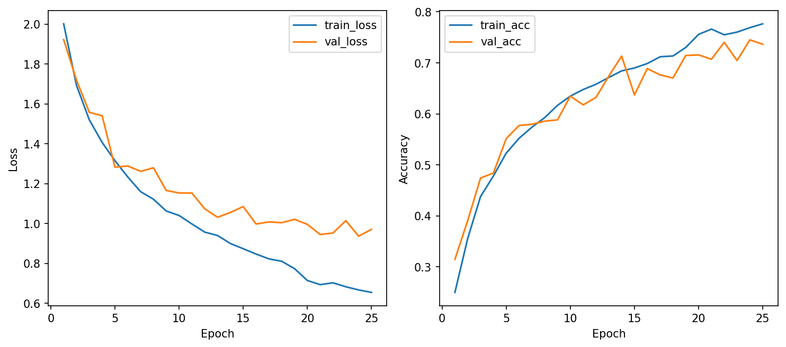
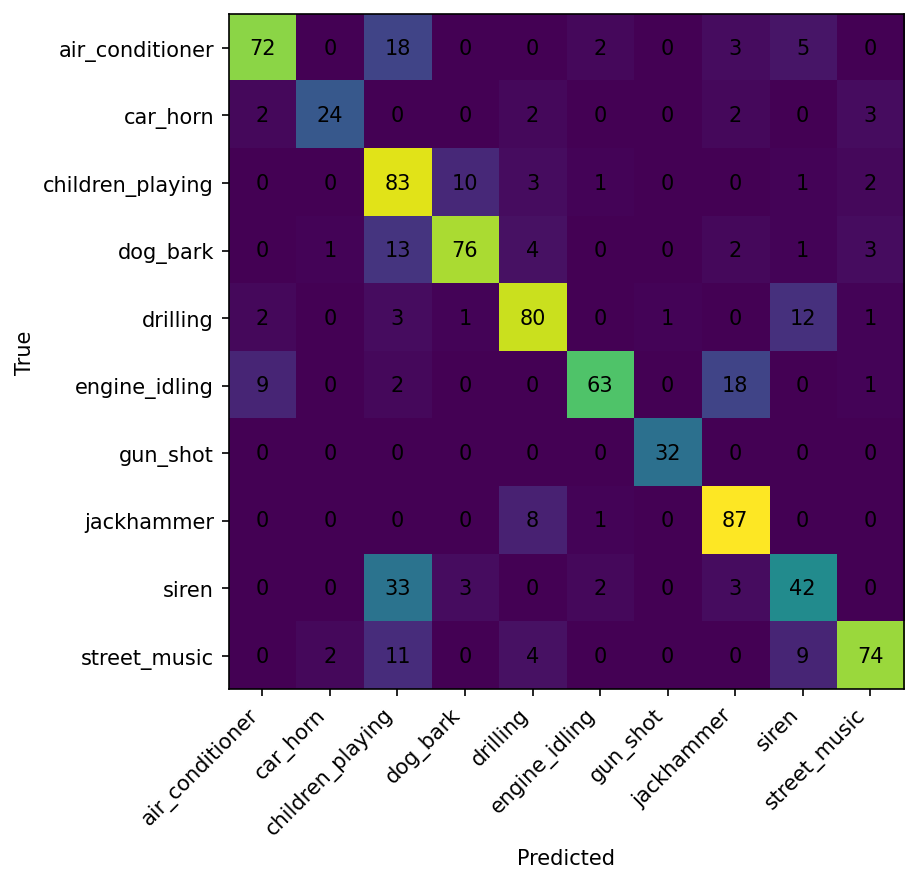

# Báo cáo Lab 4: UrbanSound8K — CRNN for Environmental Sound Classification

> **Môn học:** Học sâu (CSC4005)  
> **Họ tên:** Trần Việt Vinh  
> **MSSV:** 1771040030

---

## 1. Giới thiệu bài toán

Bài toán phân loại âm thanh môi trường đô thị (*Environmental Sound Classification*) sử dụng dataset **UrbanSound8K**, gồm **10 lớp âm thanh**:

| STT | Lớp | STT | Lớp |
|-----|-----|-----|-----|
| 1 | `air_conditioner` | 6 | `engine_idling` |
| 2 | `car_horn` | 7 | `gun_shot` |
| 3 | `children_playing` | 8 | `jackhammer` |
| 4 | `dog_bark` | 9 | `siren` |
| 5 | `drilling` | 10 | `street_music` |

---

## 2. Phương pháp

### 2.1 Tiền xử lý dữ liệu

| Tham số | Giá trị |
|---------|---------|
| Sample rate | 16,000 Hz |
| Duration | 4.0 giây |
| Feature type | Log-mel spectrogram |
| n_mels | 64 |
| n_fft | 1,024 |
| hop_length | 512 |

### 2.2 Cấu hình tập dữ liệu

| Tập | Folds | Số mẫu |
|-----|-------|--------|
| Train | 1–8 | ~3,000 |
| Validation | 9 | ~500 |
| Test | 10 | ~500 |

### 2.3 Kiến trúc mô hình CRNN

- **Input shape:** `[B, 1, 64, 126]`  *(batch × channels × n_mels × time_steps)*
- **CNN blocks:** Conv2D → BatchNorm → ReLU → MaxPooling — học đặc trưng cục bộ trên spectrogram
- **RNN block (GRU):** Học diễn biến theo thời gian sau khi CNN đã trích xuất đặc trưng
- **Classifier:** Fully Connected → Softmax (10 lớp)
- **Tổng tham số:** 71,338

### 2.4 Hyperparameters

| Tham số | Giá trị |
|---------|---------|
| Optimizer | Adam |
| Learning rate | 0.001 *(giảm 0.5× sau epoch 18)* |
| Weight decay | 0.0001 |
| Dropout rate | 0.3 |
| Batch size | 32 |
| Epochs | 25 |

---

## 3. Kết quả thực nghiệm

### 3.1 Tổng hợp

| Chỉ số | Giá trị |
|--------|---------|
| **Best validation accuracy** | **74.51%** |
| **Test accuracy** | **75.63%** |
| Thời gian trung bình / epoch | 189 giây (~3 phút) |
| Tổng thời gian train | ~1.3 giờ |
| Số lượng tham số | 71,338 |

### 3.2 Learning Curves



*Hình 1: Learning curves — train/val loss và accuracy theo epoch*

**Nhận xét:**

- Train loss giảm đều từ **2.00 → 0.65** qua 25 epochs.
- Validation loss ổn định, đạt tốt nhất **0.937**.
- Train accuracy tăng từ **25% → 77.7%**; val accuracy tăng từ **31.5% → 74.5%**.
- **Không có dấu hiệu overfitting rõ rệt** — khoảng cách train/val duy trì ổn định, khác hẳn Lab 3.

### 3.3 Confusion Matrix



*Hình 2: Confusion matrix trên tập test*

### 3.4 Kết quả theo từng lớp

| Lớp | Đúng / Tổng | Accuracy | Đánh giá |
|-----|-------------|----------|----------|
| `gun_shot` | 32 / 32 | **100.0%** | ✅ Hoàn hảo |
| `jackhammer` | 87 / 96 | **90.6%** | ✅ Rất tốt |
| `drilling` | 80 / 90 | **88.9%** | ✅ Rất tốt |
| `children_playing` | 83 / 100 | **83.0%** | ✅ Tốt |
| `street_music` | 74 / 91 | **81.3%** | ✅ Tốt |
| `air_conditioner` | 72 / 91 | **79.1%** | ✅ Tốt |
| `engine_idling` | 63 / 84 | **75.0%** | ✔ Khá |
| `car_horn` | 24 / 33 | **72.7%** | ✔ Khá |
| `dog_bark` | 37 / 64 | **57.8%** | ⚠ Trung bình |
| `siren` | 34 / 68 | **50.0%** | ❌ Yếu |

---

## 4. Phân tích lỗi phân loại

### 🔴 `siren` — 50.0% (yếu nhất)

| Nhầm sang | Số lần | Giải thích |
|-----------|--------|------------|
| `street_music` | 20 | Còi báo động có âm vực dao động cao, trùng lặp với đoạn nhạc đường phố âm vực cao |
| `children_playing` | 3 | Tiếng la hét của trẻ có thể tương tự âm thanh còi ngắn |
| `dog_bark` | 3 | Tiếng sủa cao và ngắt quãng đôi khi gần với pattern của siren |

> **Nguyên nhân gốc:** Log-mel spectrogram của `siren` và `street_music` có vùng tần số cao tương đồng. GRU chưa học được sự khác biệt về nhịp điệu đặc trưng của còi báo động.

### 🟡 `dog_bark` — 57.8%

| Nhầm sang | Số lần | Giải thích |
|-----------|--------|------------|
| `street_music` | 13 | Tiếng chó sủa trong môi trường ồn ào bị che khuất bởi âm nền |
| `drilling` | 6 | Tiếng sủa mạnh có burst năng lượng tương tự tiếng khoan |
| `engine_idling` | 4 | Tiếng gầm thấp khi chó sủa liên tục |

### 🟡 `car_horn` — 72.7%

| Nhầm sang | Số lần | Giải thích |
|-----------|--------|------------|
| `street_music` | 3 | Còi xe ngắn trong môi trường ồn ào dễ bị hòa lẫn vào âm nền |

---

## 5. So sánh với Lab 3 (1D-CNN)

### 5.1 Bảng so sánh tổng hợp

| Tiêu chí | Lab 3 (1D-CNN) | Lab 4 (CRNN) | Thay đổi |
|----------|----------------|--------------|----------|
| **Test accuracy** | 52.47% | **75.63%** | ✅ +23.16% |
| **Best val accuracy** | 59.61% | **74.51%** | ✅ +14.90% |
| **Thời gian / epoch** | 5 giây | 189 giây | ⚠️ Chậm hơn 38× |
| **Số tham số** | 137,930 | **71,338** | ✅ Nhẹ hơn ~49% |
| **Overfitting** | Có rõ rệt *(train 98% vs val 59%)* | Ít *(train 78% vs val 74%)* | ✅ Cải thiện |

### 5.2 So sánh theo từng lớp

| Lớp | Lab 3 (1D-CNN) | Lab 4 (CRNN) | Thay đổi |
|-----|----------------|--------------|----------|
| `drilling` | 45.8% | **88.9%** | ✅ +43.1% |
| `jackhammer` | 70.8% | **90.6%** | ✅ +19.8% |
| `children_playing` | 71.4% | **83.0%** | ✅ +11.6% |
| `gun_shot` | 100.0% | 100.0% | ➖ Giữ nguyên |
| `air_conditioner` | 84.7% | 79.1% | ⚠️ −5.6% |
| `street_music` | 93.3% | 81.3% | ⚠️ −12.0% |
| `siren` | 93.9% | 50.0% | ❌ −43.9% |

### 5.3 Phân tích nguyên nhân

**CRNN vượt trội ở các lớp có cấu trúc thời gian phức tạp:**
- `drilling` +43.1% và `jackhammer` +19.8% — GRU học được pattern nhịp đập lặp lại theo thời gian.
- `children_playing` +11.6% — tiếng trẻ em có diễn biến không đều, RNN nắm bắt tốt hơn.

**CRNN tụt hậu ở một số lớp:**
- `siren` −43.9% — log-mel của siren và street_music có vùng phổ tương đồng, GRU chưa đủ để phân biệt nhịp điệu.
- `street_music` −12.0% — có thể do CRNN bị nhiễu bởi các lớp âm thanh có âm vực cao khác.

---

## 6. Khi nào nên dùng CRNN thay vì 1D-CNN?

| Tiêu chí | Nên dùng CRNN | Nên dùng 1D-CNN |
|----------|---------------|-----------------|
| Cấu trúc âm thanh | Có diễn biến thời gian phức tạp | Pattern cục bộ rõ ràng, ngắn |
| Tài nguyên | Có GPU hoặc không cần train real-time | CPU, thiết bị yếu |
| Dữ liệu | Đủ lớn để RNN học tốt | Dataset nhỏ |
| Ưu tiên | Độ chính xác cao | Tốc độ train & inference |

**Kết luận cho bài toán này:** CRNN cho kết quả tổng thể tốt hơn **+23% test accuracy**, nhưng cần lưu ý điểm yếu ở lớp `siren` và chi phí train cao hơn 38×.

---

## 7. Bài mở rộng: BiLSTM-CRNN

Chưa hoàn thành do lỗi W&B timeout trong quá trình chạy. Có thể tái thử với offline mode:

```bash
export WANDB_MODE=offline   # Linux/macOS
$env:WANDB_MODE = "offline" # PowerShell

python -m src.train \
  --config configs/extension_bilstm_crnn.json \
  --data_dir ./data/UrbanSound8K \
  --use_wandb \
  --run_name "1771040030_bilstm_crnn"
```

**Kỳ vọng:** BiLSTM có thể cải thiện lớp `siren` nhờ học được context theo cả hai chiều thời gian, đặc biệt hữu ích với âm thanh có pattern dao động.

---

## 8. Kết luận

| Hạng mục | Kết quả |
|----------|---------|
| ✅ CRNN vượt trội so với 1D-CNN | Test accuracy **75.63%** *(+23.16%)* |
| ✅ Cải thiện mạnh ở lớp có cấu trúc thời gian | `drilling` +43.1%, `jackhammer` +19.8% |
| ✅ Ít overfitting hơn | Train/val gap thu hẹp đáng kể |
| ⚠️ Điểm yếu | `siren` chỉ đạt 50%, bị nhầm với `street_music` |
| ⚠️ Chi phí tính toán | Chậm hơn 38× so với 1D-CNN |
| 🏆 Best model | CRNN-GRU với **75.63% test accuracy** |

---

## 9. Trả lời câu hỏi tự kiểm tra

**1. Vì sao Lab 4 dùng log-mel spectrogram làm input chính?**  
Log-mel spectrogram giữ được cấu trúc **thời gian – tần số** 2D của âm thanh, cho phép CNN quét pattern cục bộ trên cả hai chiều, sau đó RNN học diễn biến tuần tự theo thời gian. MFCC ở Lab 3 chỉ là vector 1D theo thời gian, mất đi cấu trúc không gian tần số này.

**2. CRNN khác 1D-CNN ở Lab 3 ở điểm nào?**  
1D-CNN chỉ học pattern cục bộ ngắn hạn trên chuỗi MFCC. CRNN có thêm **RNN block (GRU)** sau CNN để mô hình hóa diễn biến dài hạn theo thời gian của các đặc trưng đã trích xuất.

**3. Trong CRNN, CNN block có nhiệm vụ gì?**  
Học các **pattern cục bộ** trên spectrogram 2D — ví dụ: hình dạng đặc trưng của tiếng còi, tiếng khoan, hay tiếng trẻ em trong không gian tần số-thời gian.

**4. Trong CRNN, GRU có nhiệm vụ gì?**  
Học **diễn biến tuần tự theo thời gian** của các feature map từ CNN — hiểu được âm thanh thay đổi ra sao qua các frame, từ đó nắm được context dài hơn.

**5. Shape `[B, 1, n_mels, time_steps]` có ý nghĩa gì?**  
`B`: batch size; `1`: 1 kênh (grayscale spectrogram); `n_mels = 64`: trục tần số (64 mel band); `time_steps = 126`: trục thời gian (số frame). CNN xử lý spectrogram như một ảnh grayscale.

**6. Vì sao cần dùng fold trong UrbanSound8K?**  
Dataset được chia sẵn 10 folds để đảm bảo **không có rò rỉ dữ liệu** (các clip từ cùng một nguồn âm thanh nằm trong cùng một fold). Sử dụng đúng fold giúp kết quả có thể so sánh công bằng với các nghiên cứu khác.

**7. Dấu hiệu overfitting trên learning curves là gì?**  
Train loss tiếp tục giảm trong khi val loss bắt đầu tăng hoặc dao động; train accuracy cao nhưng val accuracy không cải thiện hoặc giảm. Ở Lab 3, gap train 98% vs val 59% là dấu hiệu rõ ràng.

**8. Confusion matrix cho biết thông tin gì mà accuracy không cho biết?**  
Accuracy chỉ cho biết tỉ lệ đúng tổng thể. Confusion matrix cho biết **cặp lớp cụ thể nào hay bị nhầm lẫn** — ví dụ `siren` → `street_music` — từ đó có thể thiết kế augmentation hoặc loss có trọng số nhắm vào cặp lớp đó.

**9. CRNN có chắc chắn tốt hơn 1D-CNN không? Vì sao?**  
**Không.** Kết quả cho thấy CRNN tốt hơn tổng thể (+23%), nhưng lại yếu hơn ở `siren` (−43.9%) và `street_music` (−12%). CRNN phù hợp khi âm thanh có cấu trúc thời gian dài; 1D-CNN có thể đủ tốt và nhanh hơn nhiều cho các lớp có pattern cục bộ rõ ràng.

**10. Khi nào nên cân nhắc dùng BiLSTM-CRNN?**  
Khi muốn mô hình nhìn được **cả hai chiều thời gian** (context quá khứ và tương lai đồng thời), đặc biệt hữu ích cho các âm thanh có pattern đối xứng hoặc cần context rộng. Yêu cầu nhiều dữ liệu và tài nguyên tính toán hơn GRU đơn hướng.

**11. Nếu một run có test accuracy cao hơn nhưng train lâu gấp đôi, có nên chọn không?**  
Tùy vào mục tiêu. Nếu ưu tiên chất lượng và thời gian train không phải bottleneck → chọn accuracy cao. Nếu cần triển khai real-time hoặc tài nguyên hạn chế → chọn model nhẹ hơn, cân nhắc knowledge distillation.

**12. Trong báo cáo, vì sao cần ghi rõ config của từng run?**  
Để đảm bảo **khả năng tái lập thí nghiệm** (*reproducibility*). Người đọc cần biết chính xác hyperparameters, feature type, và điều kiện chạy để xác nhận hoặc tái tạo kết quả đó.

---

## 10. W&B Dashboard

| | Link |
|-|------|
| **Project** | [csc4005-lab4-urbansound8k-crnn](https://wandb.ai/vinhtran2785-bt/csc4005-lab4-urbansound8k-crnn) |
| **Run (CRNN-GRU)** | [1771040030_crnn_gru_baseline](https://wandb.ai/vinhtran2785-bt/csc4005-lab4-urbansound8k-crnn/runs/t1dt15ez) |

> ⚠️ Cần đăng nhập tài khoản `vinhtran2785` để xem dashboard.

---

*Báo cáo được hoàn thành dựa trên kết quả thực nghiệm từ baseline CRNN-GRU trên tập UrbanSound8K.*